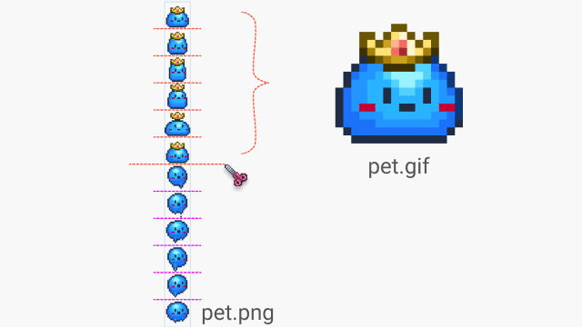

# 说明
将Sprite按等份分割成png，同时生成gif。<br><br>
<br><br>


**使用说明**
<br>
调用 Imagemagick 实现功能，请将 convert.exe 和 bat格式的脚本 放在同一个目录下，否则脚本无法工作。它是一个命令行工具，双击它会一闪而过，只能通过命令行来使用。<br>

convert.exe 是 ImageMagick 的命令行程序，ImageMagick 是一套功能强大、稳定而且免费的工具集和开发包，可以用来读、写和处理超过90种的图片文件，包括流行的TIFF、JPEG、GIF、 PNG、PDF以及PhotoCD等格式。
<br><br><br>


# 核心命令
```shell
rem 裁剪图片命令
convert !inFile! -crop !oneW!x!oneH!+!cx!+!cy! "!outFile!"


rem 生成gif命令
convert -delay !delay! -loop 0 !frames! -set dispose background +repage "!outFile!"

rem 获取图片宽高的方法
for /f "delims=" %%i in ('convert !inFile! -format "%%w" info:') do (set pngW=%%i)
for /f "delims=" %%i in ('convert !inFile! -format "%%h" info:') do (set pngH=%%i)


rem 无损放大像素图的方法
rem -filter Point -resize !sOneW!x!sOneH!
convert !inFile! -crop !oneW!x!oneH!+!cx!+!cy! -filter Point -resize !sOneW!x!sOneH! "!outFile!"
```


# 示例素材：
示例素材来自游戏《泰拉瑞亚》 ，版权归泰拉瑞亚公司所有。